---
## Front matter
title: "Отчет по лабораторной работе №3"
subtitle: "Дисциплина: Архитектура компьютера"
author: "Ким Ангелина Павловна"

## Generic otions
lang: ru-RU
toc-title: "Содержание"

## Bibliography
bibliography: bib/cite.bib
csl: pandoc/csl/gost-r-7-0-5-2008-numeric.csl

## Pdf output format
toc: true # Table of contents
toc-depth: 2
lof: true # List of figures
lot: true # List of tables
fontsize: 12pt
linestretch: 1.5
papersize: a4
documentclass: scrreprt
## I18n polyglossia
polyglossia-lang:
  name: russian
  options:
	- spelling=modern
	- babelshorthands=true
polyglossia-otherlangs:
  name: english
## I18n babel
babel-lang: russian
babel-otherlangs: english
## Fonts
mainfont: PT Serif
romanfont: PT Serif
sansfont: PT Sans
monofont: PT Mono
mainfontoptions: Ligatures=TeX
romanfontoptions: Ligatures=TeX
sansfontoptions: Ligatures=TeX,Scale=MatchLowercase
monofontoptions: Scale=MatchLowercase,Scale=0.9
## Biblatex
biblatex: true
biblio-style: "gost-numeric"
biblatexoptions:
  - parentracker=true
  - backend=biber
  - hyperref=auto
  - language=auto
  - autolang=other*
  - citestyle=gost-numeric
## Pandoc-crossref LaTeX customization
figureTitle: "Рис."
tableTitle: "Таблица"
listingTitle: "Листинг"
lofTitle: "Список иллюстраций"
lotTitle: "Список таблиц"
lolTitle: "Листинги"
## Misc options
indent: true
header-includes:
  - \usepackage{indentfirst}
  - \usepackage{float} # keep figures where there are in the text
  - \floatplacement{figure}{H} # keep figures where there are in the text
---

# Цель работы

Научиться работать с системой Git, изучить идеологию и применение средств контроля версий.

# Выполнение лабораторной работы

Создаём учетную запись на сайте https://github.com/ и заполняем основные данные (рис. [-@fig:a])

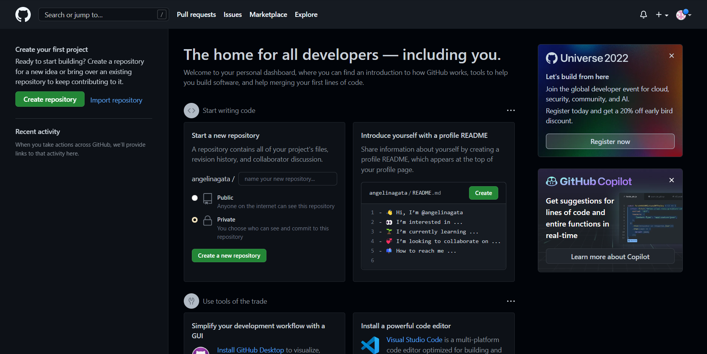{ #fig:a width=70% }

Сначала сделаем предварительную конфигурацию git. Для этого откроем терминал и введем следующие команды, указав имя и email владельца репозитория. Далее настроила utf-8 в выводе сообщений git. Следующим шагом задала имя начальной ветки (будем называть её master). (рис. [-@fig:b])

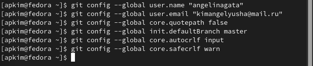{ #fig:b width=70% }

Сгенерируем пару ключей (приватный и открытый) (рис. [-@fig:c])

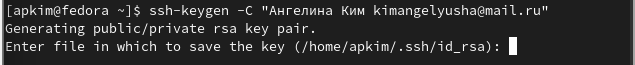{ #fig:c width=70% }

Скопируем из локальной консоли ключ в буфер обмена. (рис. [-@fig:d])

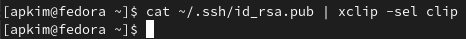{ #fig:d width=70% }

Вставляем ключ в появившееся на сайте поле и указываем для ключа имя. (рис. [-@fig:e])

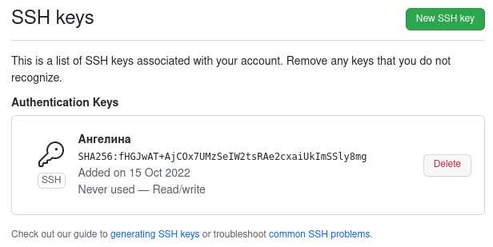{ #fig:e width=70% }

Откроем терминал и создадим каталог для предмета «Архитектура компьютера» (рис. [-@fig:f])

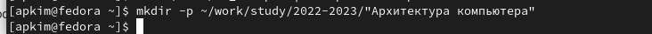{ #fig:f width=70% }

Перейдем на страницу репозитория с шаблоном курса https://github.com/yam
adharma/course-directory-student-template . Выберем Use this template. (рис. [-@fig:g])

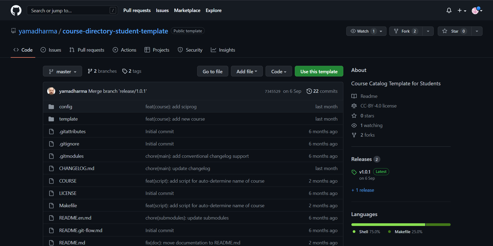{ #fig:g width=70% }

Создаем репозиторий (рис. [-@fig:h])

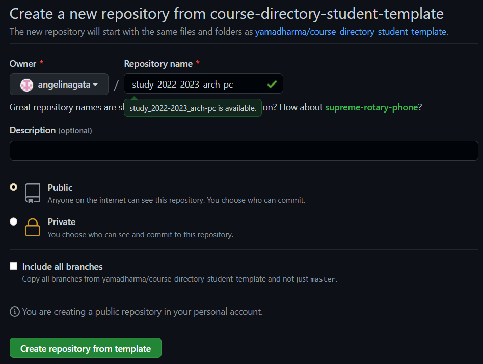{ #fig:h width=70% }

Далее открываем терминал и переходим в каталог курса, а затем копируем созданный репозиторий. (рис. [-@fig:k])

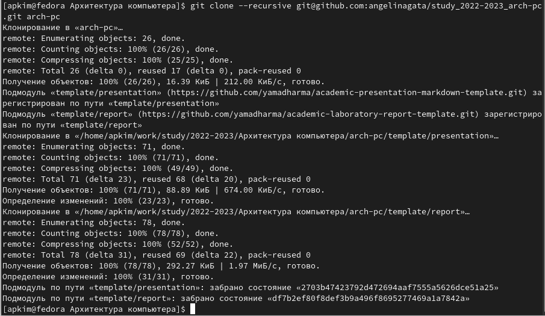{ #fig:k width=70% }

Переходим в каталог курса (рис. [-@fig:m])

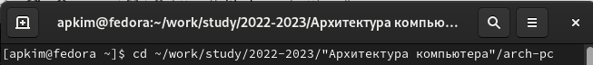{ #fig:m width=70% }

Удалим лишние файлы (рис. [-@fig:n])

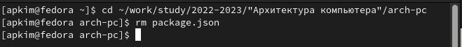{ #fig:n width=70% }

Создаем необходимые каталоги (рис. [-@fig:p])

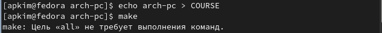{ #fig:p width=70% }

Отправляем файлы на сервер 1 (рис. [-@fig:x])

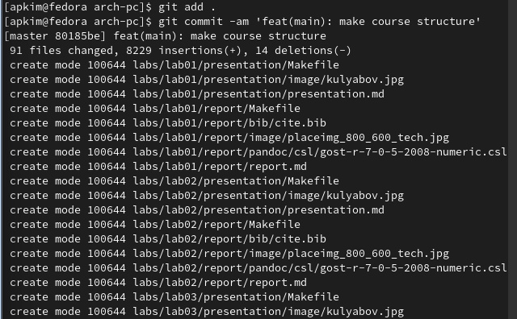{ #fig:x width=70% }

Отправляем файлы на сервер 2 (рис. [-@fig:y])

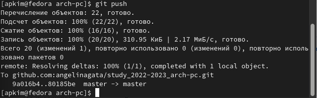{ #fig:y width=70% }

Проверяем правильность создания иерархии рабочего пространства в локальном репозитории и на странице github (рис. [-@fig:w])

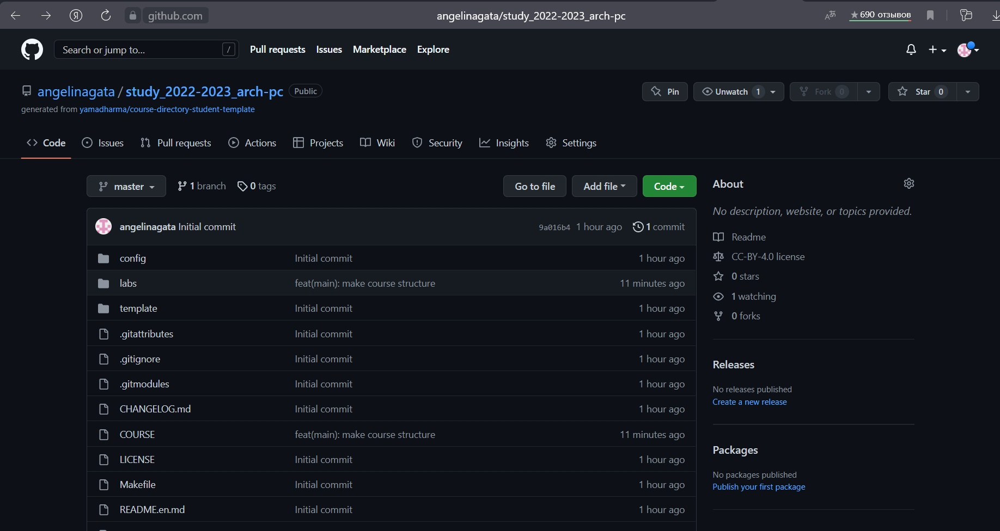{ #fig:w width=70% }

Копируем отчеты по выполнению предыдущих лабораторных работ в соответствующие каталоги созданного рабочего пространства (рис. [-@fig:z])

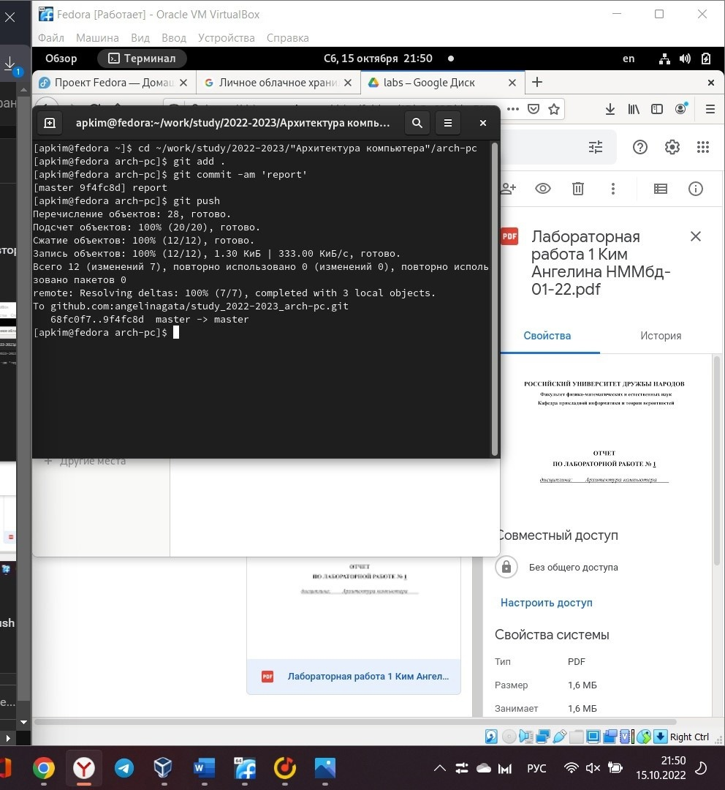{ #fig:z width=70% }

Загружаем файлы на github (1) (рис. [-@fig:q])

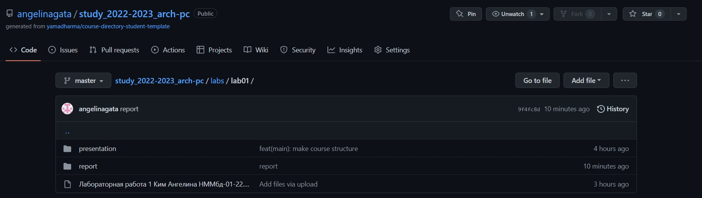{ #fig:q width=70% }

Загружаем файлы на github (2) (рис. [-@fig:t])

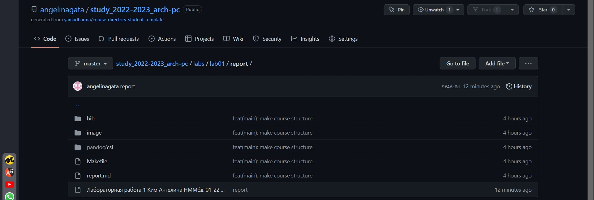{ #fig:t width=70% }

# Выводы

В ходе выполнения данной лабораторной работы я научилась работать с системой Git, изучила идеологию и применение средств контроля версий.

