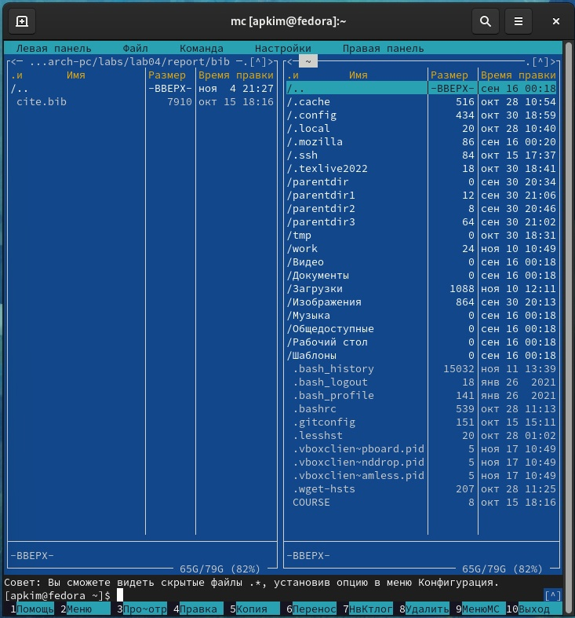
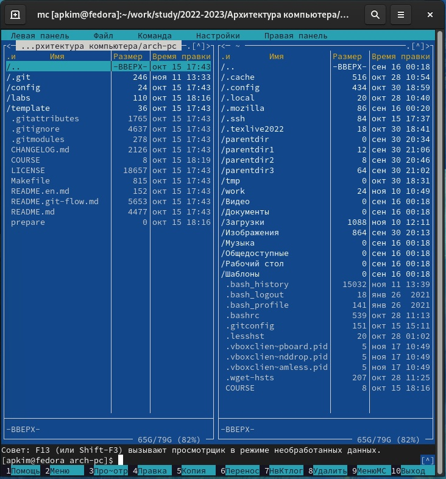
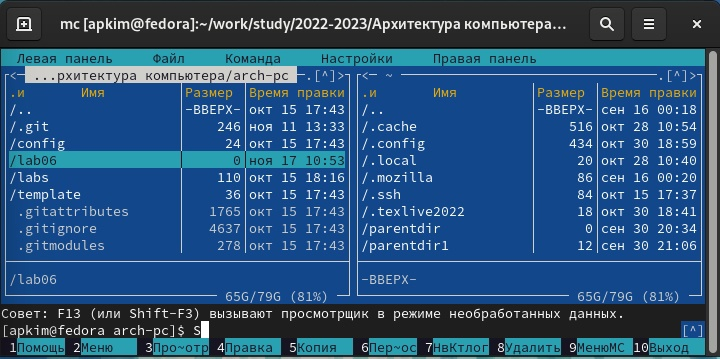
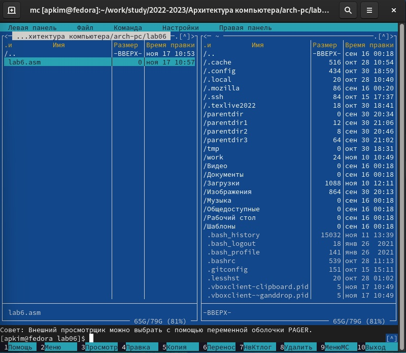
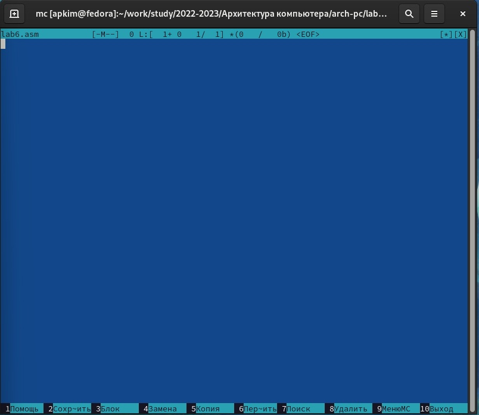

---
## Front matter
title: "Лабораторная работа №6"
subtitle: "Дисциплина: Архитектура компьютера"
author: "Ким Ангелина Павловна"

## Generic otions
lang: ru-RU
toc-title: "Содержание"

## Bibliography
bibliography: bib/cite.bib
csl: pandoc/csl/gost-r-7-0-5-2008-numeric.csl

## Pdf output format
toc: true # Table of contents
toc-depth: 2
lof: true # List of figures
lot: true # List of tables
fontsize: 12pt
linestretch: 1.5
papersize: a4
documentclass: scrreprt
## I18n polyglossia
polyglossia-lang:
  name: russian
  options:
	- spelling=modern
	- babelshorthands=true
polyglossia-otherlangs:
  name: english
## I18n babel
babel-lang: russian
babel-otherlangs: english
## Fonts
mainfont: PT Serif
romanfont: PT Serif
sansfont: PT Sans
monofont: PT Mono
mainfontoptions: Ligatures=TeX
romanfontoptions: Ligatures=TeX
sansfontoptions: Ligatures=TeX,Scale=MatchLowercase
monofontoptions: Scale=MatchLowercase,Scale=0.9
## Biblatex
biblatex: true
biblio-style: "gost-numeric"
biblatexoptions:
  - parentracker=true
  - backend=biber
  - hyperref=auto
  - language=auto
  - autolang=other*
  - citestyle=gost-numeric
## Pandoc-crossref LaTeX customization
figureTitle: "Рис."
tableTitle: "Таблица"
listingTitle: "Листинг"
lofTitle: "Список иллюстраций"
lotTitle: "Список таблиц"
lolTitle: "Листинги"
## Misc options
indent: true
header-includes:
  - \usepackage{indentfirst}
  - \usepackage{float} # keep figures where there are in the text
  - \floatplacement{figure}{H} # keep figures where there are in the text
---

# Цель работы

Приобретение практических навыков работы в Midnight Commander. Освоение инструкций языка ассемблера mov и int.

# Выполнение лабораторной работы

Открываем Midnight Commander (рис. [-@fig:001])

{ #fig:001 width=70% }

Переходим в каталог ~/work/arch-pc (рис. [-@fig:002])

{ #fig:002 width=70% }

Создаем папку lab06 (рис. [-@fig:003])

{ #fig:003 width=70% }

Пользуясь строкой ввода и командой touch создаем файл lab6-1.asm (рис. [-@fig:004])

{ #fig:004 width=70% }

Используем встроенный редактор (рис. [-@fig:005])

{ #fig:005 width=70% }

Вводим текст программы из листинга 6.1, сохраняем изменения и закрываем файл (рис. [-@fig:006])

![Вводим текст программы] (image/6.jpg){ #fig:006 width=70% }

Оттранслируем текст программы lab6-1.asm в объектный файл. (рис. [-@fig:007])

![Оттранслируем текст программы] (image/7.jpg){ #fig:007 width=70% }

Скачиваем файл in_out.asm со страницы курса в ТУИС. Этот файл должен лежать в том же каталоге, что и файл с программой, в которой он используется. (рис. [-@fig:008])

![Скачиваем файл] (image/8.jpg){ #fig:008 width=70% }

Создаем копию файла lab6-1.asm с именем lab6-2.asm (рис. [-@fig:009])

![Создаем копию] (image/9.jpg){ #fig:009 width=70% }

Создаем исполянемый файл и проверяем его работу (рис. [-@fig:0010])

![Создание исполняемого файла] (image/10.jpg){ #fig:0010 width=70% }

Задания для самостоятельной работы.
1 задание. Создаем копию файла lab6-1.asm.  (рис. [-@fig:0011])

![Создание копии] (image/11.jpg){ #fig:0011 width=70% }

Вносим изменения в программу (без использования внешнего файла in_out.asm) (рис. [-@fig:0015])

![Вносим изменения] (image/15.jpg){ #fig:0015 width=70% }

2 задание. Получаем исполняемый файл и проверяем его работу (рис. [-@fig:0014])

![Получаем исполняемый файл] (image/14.jpg){ #fig:0014 width=70% }

3 задание. Создаем копию файла lab6-2.asm, исправляем текст программы с использованием подпрограмм из внешнего файла in_out.asm (рис. [-@fig:0012])

![Исправляем текст программы] (image/14.jpg){ #fig:0014 width=70% }

4 задание. Создаем исполянемый файл и проверяем его работу (рис. [-@fig:0013])

![Получаем исполняемый файл] (image/13.jpg){ #fig:0013 width=70% }

# Выводы

В ходе данной лабораторной работы мы научились приобретать навыки работы в Midnight Commander. Освоили инструкции языка ассемблера mov и int.

# Список литературы{.unnumbered}

::: {#refs}
:::
