---
## Front matter
title: "Лабораторная работа №7"
subtitle: "Дисциплина: Архитектура компьютера"
author: "Ким Ангелина Павловна"

## Generic otions
lang: ru-RU
toc-title: "Содержание"

## Bibliography
bibliography: bib/cite.bib
csl: pandoc/csl/gost-r-7-0-5-2008-numeric.csl

## Pdf output format
toc: true # Table of contents
toc-depth: 2
lof: true # List of figures
lot: true # List of tables
fontsize: 12pt
linestretch: 1.5
papersize: a4
documentclass: scrreprt
## I18n polyglossia
polyglossia-lang:
  name: russian
  options:
	- spelling=modern
	- babelshorthands=true
polyglossia-otherlangs:
  name: english
## I18n babel
babel-lang: russian
babel-otherlangs: english
## Fonts
mainfont: PT Serif
romanfont: PT Serif
sansfont: PT Sans
monofont: PT Mono
mainfontoptions: Ligatures=TeX
romanfontoptions: Ligatures=TeX
sansfontoptions: Ligatures=TeX,Scale=MatchLowercase
monofontoptions: Scale=MatchLowercase,Scale=0.9
## Biblatex
biblatex: true
biblio-style: "gost-numeric"
biblatexoptions:
  - parentracker=true
  - backend=biber
  - hyperref=auto
  - language=auto
  - autolang=other*
  - citestyle=gost-numeric
## Pandoc-crossref LaTeX customization
figureTitle: "Рис."
tableTitle: "Таблица"
listingTitle: "Листинг"
lofTitle: "Список иллюстраций"
lotTitle: "Список таблиц"
lolTitle: "Листинги"
## Misc options
indent: true
header-includes:
  - \usepackage{indentfirst}
  - \usepackage{float} # keep figures where there are in the text
  - \floatplacement{figure}{H} # keep figures where there are in the text
---

# Цель работы

Освоение арифметических инструкций языка ассемблера NASM.

# Задание

Здесь приводится описание задания в соответствии с рекомендациями
методического пособия и выданным вариантом.

# Выполнение лабораторной работы

Создаем каталог для программ лабораторной работы №7, переходим в него и создаем файл lab7-1.asm (рис. [-@fig:001])

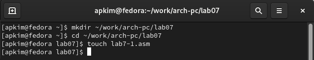{ #fig:001 width=70% }

Введем в файл lab7-1.asm текст программы из листинга 7.1. (рис. [-@fig:002])

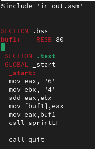{ #fig:002 width=70% }

Создаем исполняемый файл и запускаем его. (рис. [-@fig:003])

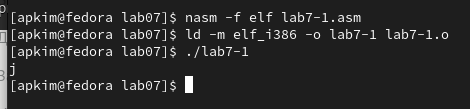{ #fig:003 width=70% }

Далее изменяем текст программы и вместо символов, запишем в регистры числа. (рис. [-@fig:004])

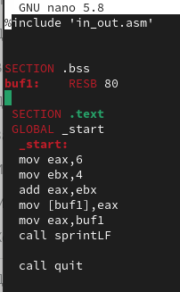{ #fig:004 width=70% }

Создаем исполняемый файл и запускаем его. Этот символ не отображается при выводе на экран, так как символ 10 - символ перевода строки (рис. [-@fig:005])

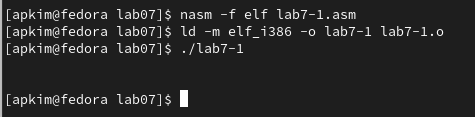{ #fig:005 width=70% }

Создаем файл lab7-2.asm и вводим в него текст программы из листинга 7.2 (рис. [-@fig:006])

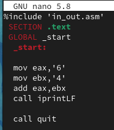{ #fig:006 width=70% }

Создаем исполняемый файл и запускаем его. (рис. [-@fig:007])

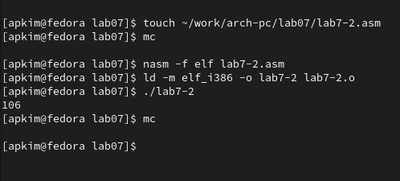{ #fig:007 width=70% }

Аналогично предыдущему примеру изменим символы на числа (рис. [-@fig:008])

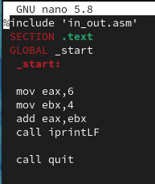{ #fig:008 width=70% }

Создаем исполняемый файл и запускаем его (рис. [-@fig:009])

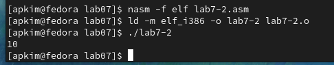{ #fig:009 width=70% }

Заменяем функцию iprintLF на iprint (рис. [-@fig:0010])

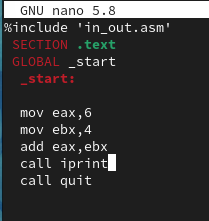{ #fig:0010 width=70% }

Создаем исполняемый файл и запускаем его (рис. [-@fig:0011])

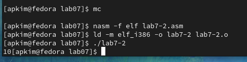{ #fig:0011 width=70% }

Создаем файл lab7-3.asm и вводим туда текст программы из листинга 7.3 (рис. [-@fig:0012])

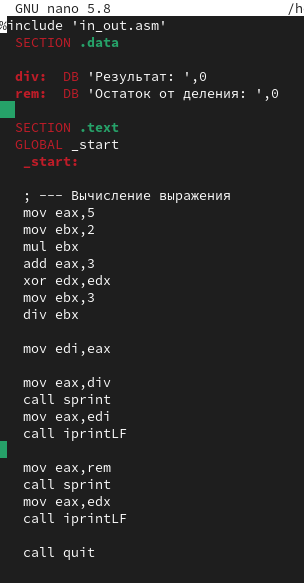{ #fig:0012 width=70% }

Создаем исполняемый файл и запускаем его (рис. [-@fig:0013])

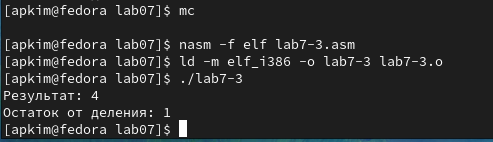{ #fig:0013 width=70% }

Изменяем текст программы для вычисления выражения f(x)=(4*6+2)/5 (рис. [-@fig:0014])

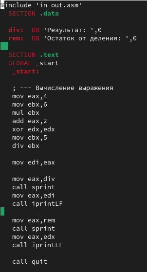{ #fig:0014 width=70% }

Создаем исполняемый файл и запускаем его (рис. [-@fig:0015])

{ #fig:0015 width=70% }

Создаем файл variant.asm и вводим в него текст программы из листинга 7.4 (рис. [-@fig:0016])

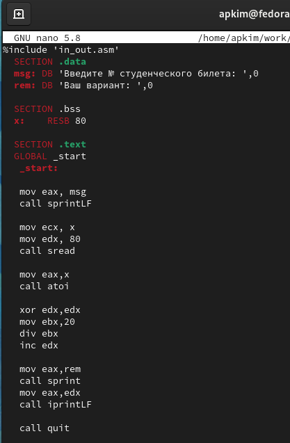{ #fig:0016 width=70% }

Создаем исполняемый файл и запускаем его (рис. [-@fig:0017])

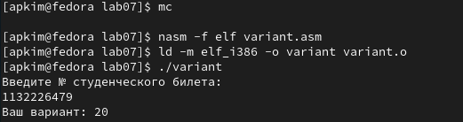{ #fig:0017 width=70% }

#Ответы на вопросы.
1. Какие строки листинга 7.4 отвечают за вывод на экран сообщения 'Ваш вариант: '? 
Ответ: mov eax,rem; call sprint
2. Для чего используется следующие инструкции? nasm mov ecx, x mov edx, 80 call sread 
Ответ: Эти инструкции используются для ввода переменной Х с клавиатуры и сохранения введенных данных.
3. Для чего используется инструкция "call atoi"?
Ответ: Эта инструкция используется для преобразование кода переменной ASCII в число.
4. Какие строки листинга 7.4 отвечают за вычисления варианта?
Ответ: xor edx,edx; mov ebx, 20 div ebx inc edx
5. В какой регистр записывается остаток от деления при выполнении инструкции "div ebx"?
Ответ: в регистре edx
6. Для чего используется инструкция "inc edx"?
Ответ: Для увеличения значения edx на 1.
7. Какие строки листинга 7.4 отвечают за вывод на экран результата вычислений?
Ответ: mov eax,edx call iprintLF

Задание для самостоятельной работы. У меня выпал вариант 20. Текст программы для функции из варианта 20. (рис. [-@fig:0018])

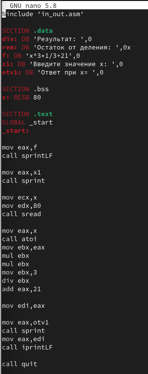{ #fig:0018 width=70% }

Создаем исполняемый файл и запускаем его (рис. [-@fig:0019])

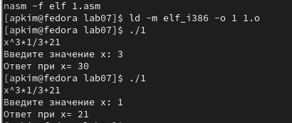{ #fig:0019 width=70% }

# Выводы

В ходе выполнения данной лабораторной работы я освоила арифметические инструкции языка ассемблера NASM.

# Список литературы{.unnumbered}

::: {#refs}
:::
