---
## Front matter
title: "Лабораторная работа №8"
subtitle: "Дисциплина: Архитектура компьютера"
author: "Ким Ангелина Павловна"

## Generic otions
lang: ru-RU
toc-title: "Содержание"

## Bibliography
bibliography: bib/cite.bib
csl: pandoc/csl/gost-r-7-0-5-2008-numeric.csl

## Pdf output format
toc: true # Table of contents
toc-depth: 2
lof: true # List of figures
lot: true # List of tables
fontsize: 12pt
linestretch: 1.5
papersize: a4
documentclass: scrreprt
## I18n polyglossia
polyglossia-lang:
  name: russian
  options:
	- spelling=modern
	- babelshorthands=true
polyglossia-otherlangs:
  name: english
## I18n babel
babel-lang: russian
babel-otherlangs: english
## Fonts
mainfont: PT Serif
romanfont: PT Serif
sansfont: PT Sans
monofont: PT Mono
mainfontoptions: Ligatures=TeX
romanfontoptions: Ligatures=TeX
sansfontoptions: Ligatures=TeX,Scale=MatchLowercase
monofontoptions: Scale=MatchLowercase,Scale=0.9
## Biblatex
biblatex: true
biblio-style: "gost-numeric"
biblatexoptions:
  - parentracker=true
  - backend=biber
  - hyperref=auto
  - language=auto
  - autolang=other*
  - citestyle=gost-numeric
## Pandoc-crossref LaTeX customization
figureTitle: "Рис."
tableTitle: "Таблица"
listingTitle: "Листинг"
lofTitle: "Список иллюстраций"
lotTitle: "Список таблиц"
lolTitle: "Листинги"
## Misc options
indent: true
header-includes:
  - \usepackage{indentfirst}
  - \usepackage{float} # keep figures where there are in the text
  - \floatplacement{figure}{H} # keep figures where there are in the text
---

# Цель работы

Цель данной работы: изучить команды условного и безусловного перехода, приобрести навыки написания программ с использованием перехода, познакомиться с назначением и структурой файла листинга.

# Выполнение лабораторной работы

Создаем каталог для программ лабораторной работы №8, переходим в него и создаем файл lab8-1.asm (рис. [-@fig:001])

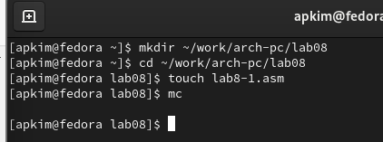{ #fig:001 width=70% }

Введем в файл lab8-1.asm текст программы из листинга 8.1 (рис. [-@fig:002])

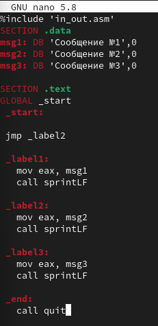{ #fig:002 width=70% }

Создаем исполняемый файл и запускаем его. (рис. [-@fig:003])

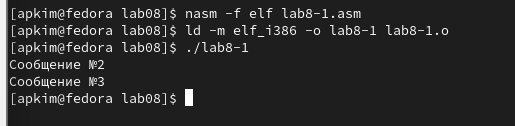{ #fig:003 width=70% }

Далее в текст программы после вывода сообщения №2 добавим инструкцию jmp с меткой _label1 и после вывода сообщения №1 добавим инструкцию jmp с меткой _end. Изменим текст программы в соответствии с листингом 8.2 (рис. [-@fig:004])

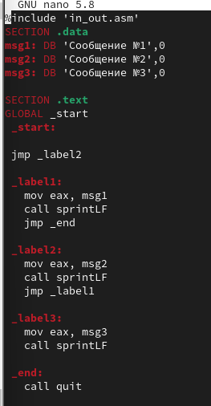{ #fig:004 width=70% }

Создаем исполняемый файл и проверяем его работу (рис. [-@fig:005])

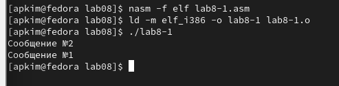{ #fig:005 width=70% }

Изменим текст программы, добавив и изменив инструкцию jmp, чтобы сообщения выводились с 3-го по 1-ый (рис. [-@fig:006])

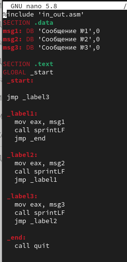{ #fig:006 width=70% }

Создаем исполняемый файл и проверяем его работу (рис. [-@fig:007])

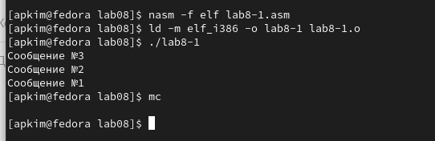{ #fig:007 width=70% }

Создаем файл lab8-2.asm, вводим в него текст программы из листинга 8.3 (рис. [-@fig:008])

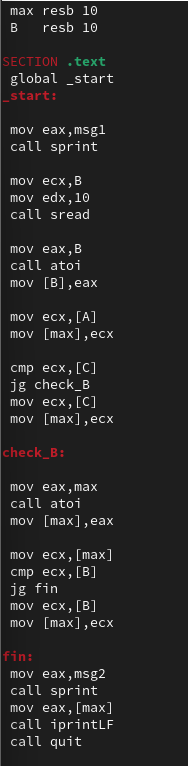{ #fig:008 width=70% }

Создаем исполняемый файл и проверяем его (рис. [-@fig:009])

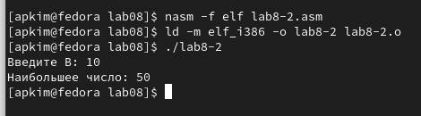{ #fig:009 width=70% }

Далее создаем файл листинга для программы из файла д=lab8-2.asm (рис. [-@fig:0010])

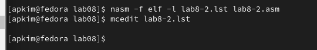{ #fig:0010 width=70% }

Открываем файл листинга с помощью текстового редактора mcedit (рис. [-@fig:0011])

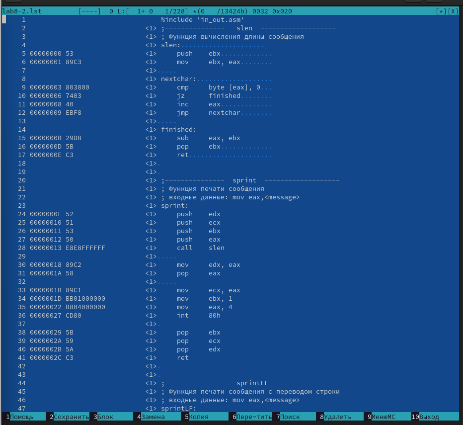{ #fig:0011 width=70% }

Открываем файл с программой lab8-2.asm и на строке 39 удаляем операнд. Выполняем трансляции с получением файла листинга (рис. [-@fig:0012])

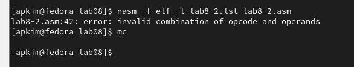{ #fig:0012 width=70% }

Открываем текстовый редактор mcedit (рис. [-@fig:0013])

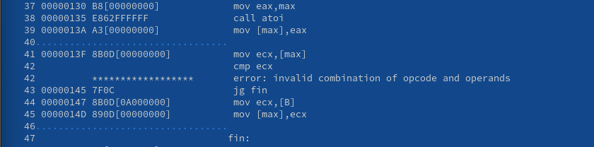{ #fig:0013 width=70% }

Задание для самостоятельной работы. 1 задание. Следует написать программу, которая из трех целочисленных переменных находит наименьшее. (рис. [-@fig:0014])

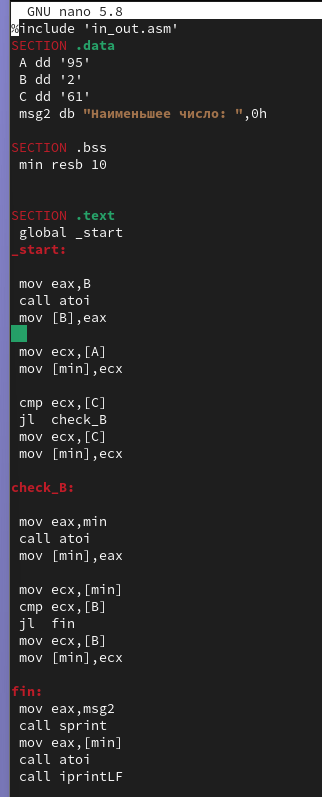{ #fig:0014 width=70% }

Текст программы задания №1 (рис. [-@fig:0015])

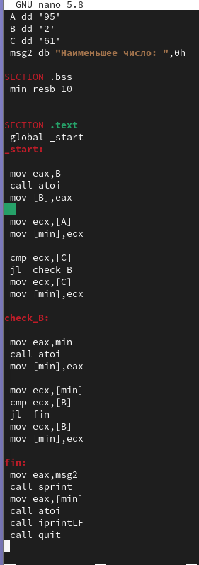{ #fig:0015 width=70% }

Создаем исполняемый файл и проверяем его. У меня был вариант-20, значит вывести программа должна была цифру 2, но она вывела 50, что в таблице ASCII соответствует символу "2" (рис. [-@fig:0016])

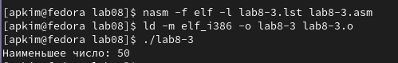{ #fig:0016 width=70% }

2 задание. Необходимо написать программу, которая для введенных с клавиатуры значений х и а вычисляет значение заданной функции f(x) и выводит результат вычислений.  (рис. [-@fig:0017])

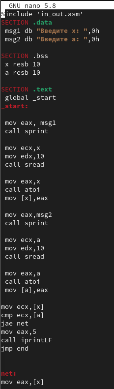{ #fig:0017 width=70% }

Продолжение программы (рис. [-@fig:0018])

{ #fig:0018 width=70% }

Создаем исполняемый файл и проверяем его (рис. [-@fig:0019])

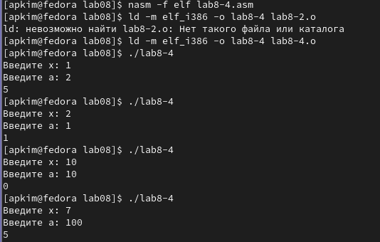{ #fig:0019 width=70% }

# Выводы

В ходе данной лабораторной работы я изучила команды условного и безусловного перехода, приобрела навыки написания программ с использованием перехода, познакомилась с назначением и структурой файла листинга.

# Список литературы{.unnumbered}

::: {#refs}
:::
