---
## Front matter
title: "Лабораторная работа №9"
subtitle: "Дисциплина: Архитектура компьютера"
author: "Ким Ангелина Павловна"

## Generic otions
lang: ru-RU
toc-title: "Содержание"

## Bibliography
bibliography: bib/cite.bib
csl: pandoc/csl/gost-r-7-0-5-2008-numeric.csl

## Pdf output format
toc: true # Table of contents
toc-depth: 2
lof: true # List of figures
lot: true # List of tables
fontsize: 12pt
linestretch: 1.5
papersize: a4
documentclass: scrreprt
## I18n polyglossia
polyglossia-lang:
  name: russian
  options:
	- spelling=modern
	- babelshorthands=true
polyglossia-otherlangs:
  name: english
## I18n babel
babel-lang: russian
babel-otherlangs: english
## Fonts
mainfont: PT Serif
romanfont: PT Serif
sansfont: PT Sans
monofont: PT Mono
mainfontoptions: Ligatures=TeX
romanfontoptions: Ligatures=TeX
sansfontoptions: Ligatures=TeX,Scale=MatchLowercase
monofontoptions: Scale=MatchLowercase,Scale=0.9
## Biblatex
biblatex: true
biblio-style: "gost-numeric"
biblatexoptions:
  - parentracker=true
  - backend=biber
  - hyperref=auto
  - language=auto
  - autolang=other*
  - citestyle=gost-numeric
## Pandoc-crossref LaTeX customization
figureTitle: "Рис."
tableTitle: "Таблица"
listingTitle: "Листинг"
lofTitle: "Список иллюстраций"
lotTitle: "Список таблиц"
lolTitle: "Листинги"
## Misc options
indent: true
header-includes:
  - \usepackage{indentfirst}
  - \usepackage{float} # keep figures where there are in the text
  - \floatplacement{figure}{H} # keep figures where there are in the text
---

# Цель работы

В ходе данной лабораторной работы мне нужно приобрести навыки написания программ с использованием циклов и обработкой аргументов командной строки.

# Задание

Здесь приводится описание задания в соответствии с рекомендациями
методического пособия и выданным вариантом.

# Выполнение лабораторной работы

Создаем каталог для программ лабораторной работы №9, переходим в него и создаем файл lab9-1.asm (рис. [-@fig:001])

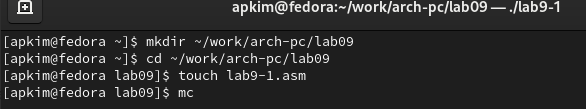{ #fig:001 width=70% }

Введем в файл lab9-1.asm текст программы из листинга 9.1.  (рис. [-@fig:002])

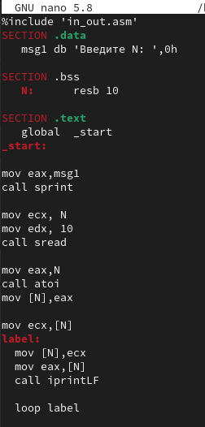{ #fig:002 width=70% }

Создаем исполняемый файл и проверяем его работу. (рис. [-@fig:003])

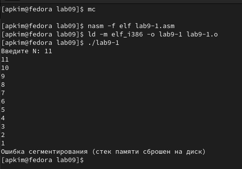{ #fig:003 width=70% }

Меняем текст программы, добавив изменение значения регистра ecx в цикле (рис. [-@fig:004])

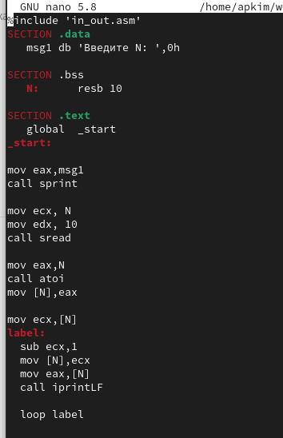{ #fig:004 width=70% }

Создаем исполняемый файл и проверяем его работу. Данный пример показывает, что использование регистра ecx в теле цикла может привести к некорректной работе программы. Число проходов не соответствует значению N введенному с клавиатуры, программа зациклилась. (рис. [-@fig:005])

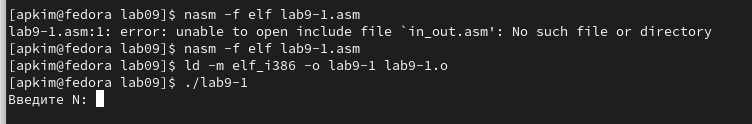{ #fig:005 width=70% }

Вносим изменения в текст программы, добавив команды push и pop (добавление в стек и извлечения из стека) для сохранения значения счетчика цикла. (рис. [-@fig:006])

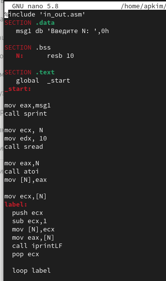{ #fig:006 width=70% }

Создаем исполняемый файл и проверяем его работу. В данном случае число проходов цикла значению N введенному с клавиатуры. (рис. [-@fig:007])

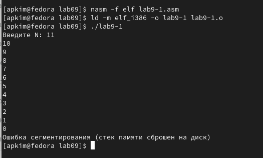{ #fig:007 width=70% }

Создаем файл lab9-2.asm и вводим в него текст программы из листинга 9.2 (рис. [-@fig:008])

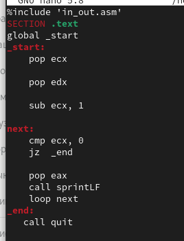{ #fig:008 width=70% }

Создаем исполняемый файл и проверяем его работу. Программой было обработано 4 аргумента (рис. [-@fig:009])

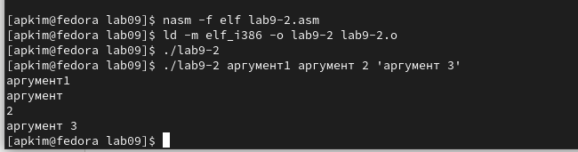{ #fig:009 width=70% }

Создаем файл lab9-3.asm и вводим туда текст программы из листинга 9.3 (рис. [-@fig:0010])

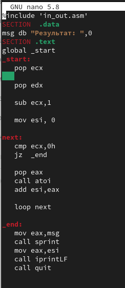{ #fig:0010 width=70% }

Создаем исполняемый файл и проверяем его работу, указав аргументы.(рис. [-@fig:0011])

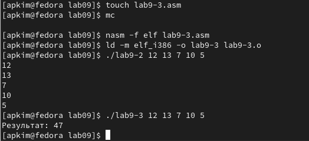{ #fig:0011 width=70% }

Изменяем текст программы из листинга 9.3 для вычисления произведения аргументов командной строки. (рис. [-@fig:0012])

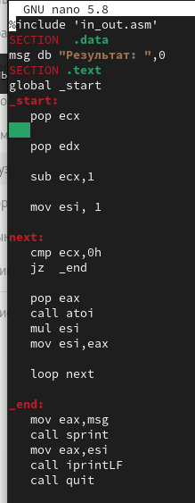{ #fig:0012 width=70% }

Создаем исполняемый файл и проверяем его работу. (рис. [-@fig:0013])

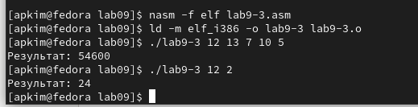{ #fig:0013 width=70% }

Задание для самостоятельной работы. У меня вариант 20. Текст программы, которая находит сумму значений функции. (рис. [-@fig:0014])

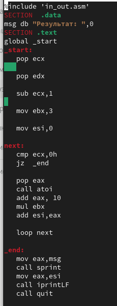{ #fig:0014 width=70% }

Создаем исполняемый файл и проверяем его работу. (рис. [-@fig:0015])

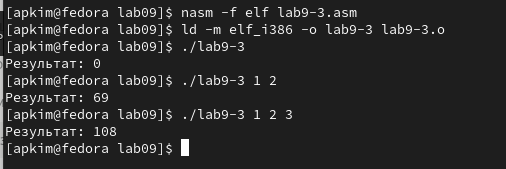{ #fig:0015 width=70% }

# Выводы

Исходя из этой работы, я приобрела навыки написания программ с использованием циклов и обработкой аргументов командной строки.

# Список литературы{.unnumbered}

::: {#refs}
:::
