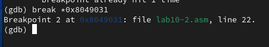
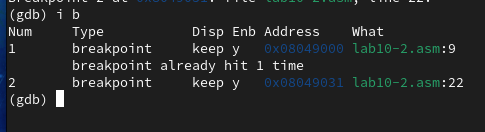
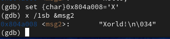
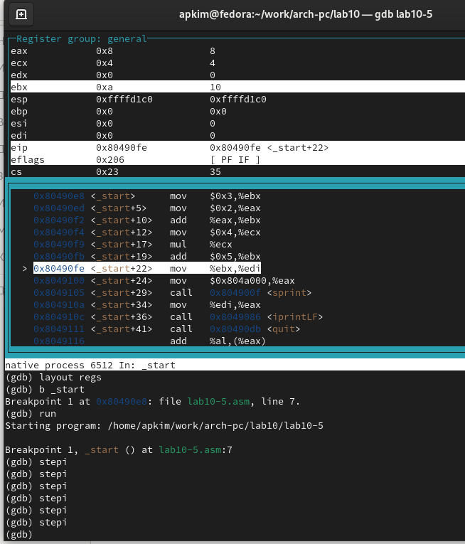

---
## Front matter
title: "Лабораторная работа №10"
subtitle: "Дисциплина: Архитектура компьютера"
author: "Ким Ангелина Павловна"

## Generic otions
lang: ru-RU
toc-title: "Содержание"

## Bibliography
bibliography: bib/cite.bib
csl: pandoc/csl/gost-r-7-0-5-2008-numeric.csl

## Pdf output format
toc: true # Table of contents
toc-depth: 2
lof: true # List of figures
lot: true # List of tables
fontsize: 12pt
linestretch: 1.5
papersize: a4
documentclass: scrreprt
## I18n polyglossia
polyglossia-lang:
  name: russian
  options:
	- spelling=modern
	- babelshorthands=true
polyglossia-otherlangs:
  name: english
## I18n babel
babel-lang: russian
babel-otherlangs: english
## Fonts
mainfont: PT Serif
romanfont: PT Serif
sansfont: PT Sans
monofont: PT Mono
mainfontoptions: Ligatures=TeX
romanfontoptions: Ligatures=TeX
sansfontoptions: Ligatures=TeX,Scale=MatchLowercase
monofontoptions: Scale=MatchLowercase,Scale=0.9
## Biblatex
biblatex: true
biblio-style: "gost-numeric"
biblatexoptions:
  - parentracker=true
  - backend=biber
  - hyperref=auto
  - language=auto
  - autolang=other*
  - citestyle=gost-numeric
## Pandoc-crossref LaTeX customization
figureTitle: "Рис."
tableTitle: "Таблица"
listingTitle: "Листинг"
lofTitle: "Список иллюстраций"
lotTitle: "Список таблиц"
lolTitle: "Листинги"
## Misc options
indent: true
header-includes:
  - \usepackage{indentfirst}
  - \usepackage{float} # keep figures where there are in the text
  - \floatplacement{figure}{H} # keep figures where there are in the text
---

# Цель работы

Приобретение навыков написания программ с использованием подпрограмм. Знакомство с методами отладки при помощи GDB и его основными возможностями. 

# Выполнение лабораторной работы

Создали каталог для выполнения лабораторной работы №10, переходим в него и создаем файл lab10-1.asm (рис. [-@fig:001])

{ #fig:001 width=70% }

Введем в файл lab10-1.asm текст программы из листинга 10.1. (рис. [-@fig:002])

{ #fig:002 width=70% }

Создаем исполняемый файл и проверяем его работу (рис. [-@fig:003])

{ #fig:003 width=70% }

Изменяем текст программы, добавив подпрограмму _subcalcul в подпрограмму _calcul (рис. [-@fig:004])

{ #fig:004 width=70% }

Создаем исполняемый файл и проверяем его работу (рис. [-@fig:005])

{ #fig:005 width=70% }

Далее создаем файл lab10-2.asm, вносим туда текст программы из листинга 10.2, создаем исполняемый файл, для работы с GDB в исполняемый файл добавили отладочную информацию, для этого трансляцию программ провели с ключом "-g". Загружаем исполняемый файл в отладчик GDB. Проверили работу программы, запустив ее в оболочке GDB с помощью команды run.  (рис. [-@fig:006])

{ #fig:006 width=70% }

Установили брейкпоинт на метку _start (рис. [-@fig:007])

{ #fig:007 width=70% }

Посмотрели дисассимилированный код программы с помощью команды disassemble начиная с метки _start (рис. [-@fig:008])

{ #fig:008 width=70% }

Переключились на отображение команд с Intel'овским синтаксисом, введя команду set disassembly-flavor intel.(рис. [-@fig:009])

{ #fig:009 width=70% }

Различия отображения синтаксиса машинных кодов в режимах ATT и Intel: в АТТ перед адресом регистра ставится $, а перед названием регистра %, сначала записывается адрес, а потом - регистр. В Intel сначала регистр, а потом адрес, и перед ними ничего не ставится. Далее переходим на режим псевдографики для более удобного анализа программы. (рис. [-@fig:0010])

{ #fig:0010 width=70% }

На предыдущих шагах была установлена точка останова по имени метки (_start). Проверяем это с помощью команды info breakpoints. (рис. [-@fig:0011])

{ #fig:0011 width=70% }

Далее определили адрес предпоследней инструкции и установили точку останова (рис. [-@fig:0012])

{ #fig:0012 width=70% }

Посмотрели информацию о всех установленных точках останова (рис. [-@fig:0013])

{ #fig:0013 width=70% }

Выполняем 5 инструкций с помощью команды stepi и проследим за изменением значения регистров (рис. [-@fig:0014])

{ #fig:0014 width=70% }

Изменяются значения регистров: eax, ecx, edx, ebx (рис. [-@fig:0015])

{ #fig:0015 width=70% }

Посмотрели содержимое регистров с помощью команды info registers (рис. [-@fig:0016])

{ #fig:0016 width=70% }

Далее посмотрели значение переменной msg1 по имени (рис. [-@fig:0017])

{ #fig:0017 width=70% }

Посмотрели значение переменной msg2 по адресу. Адрес переменной определили по дизассемблированной инструкции. Посмотрели инструкцию mov ecx, msg2 которая записывает в регистр ecx адрес переменной msg2. (рис. [-@fig:0018])

{ #fig:0018 width=70% }

Далее изменяем первый символ переменной msg1 (рис. [-@fig:0019])

{ #fig:0019 width=70% }

Заменяем первый символ во второй переменной msg2 (рис. [-@fig:0020])

{ #fig:0020 width=70% }

Чтобы посмотреть значения регистров используется команда print /F . Вывели в различных форматах (в шестнадцатеричном формате, в двоичном формате и в символьном виде) значение регистра edx.(рис. [-@fig:0021])

{ #fig:0021 width=70% }

С помощью команды set изменим значение регистра ebx (рис. [-@fig:0022])

{ #fig:0022 width=70% }

Завершили выполнение программы с помощью команды continue и выходим из GDB (рис. [-@fig:0023])

{ #fig:0023 width=70% }

Скопировали файл lab9-2.asm, созданный при выполнении лабораторной работы №9, с программой выводящей на экран аргументы командной строки (Листинг 9.2) в файл с именем lab10-3.asm (рис. [-@fig:0024])

{ #fig:0024 width=70% }

Создаем исполняемый файл (рис. [-@fig:0025])

{ #fig:0025 width=70% }

Для загрузки в gdb программы с аргументами необходимо использовать ключ –args. Загрузили исполняемый файл в отладчик, указав аргументы. Как отмечалось в предыдущей лабораторной работе, при запуске программы аргументы командной строки загружаются в стек. Исследовали расположение аргументов командной строки в стеке после запуска программы с помощью gdb. Для начала установили точку останова перед первой инструкцией в программе и запустили ее (рис. [-@fig:0026])

{ #fig:0026 width=70% }

Адрес вершины стека храниться в регистре esp и по этому адресу распола-
гается число равное количеству аргументов командной строки (включая имя
программы) (рис. [-@fig:0027])

{ #fig:0027 width=70% }

Как видно, число аргументов равно 5 – это имя программы lab10-3 и непосредственно аргументы: аргумент1, аргумент, 2 и ‘аргумент 3’. Посмотрели остальные позиции стека – по адесу [esp+4] располагается адрес в памяти где находиться имя программы, по адесу [esp+8] храниться адрес первого аргумента, по аресу [esp+12]  - второго и т.д. Шаг изменения адреса равен 4 ([esp+4], [esp+8], [esp+12] и т.д.) потому что в теле цикла next 4 строки кода. (рис. [-@fig:0028])

{ #fig:0028 width=70% }

Задание для самостоятельной работы. 1 задание. Текст программы из лабораторной работы №9, реализовав вычисление значения функции как подпрограмму. (рис. [-@fig:0029])

{ #fig:0029 width=70% }

Создаем исполняемый файл и проверяем его работу. (рис. [-@fig:0030])

{ #fig:0030 width=70% }

Создаем файл lab10-5.asm (рис. [-@fig:0031])

{ #fig:0031 width=70% }

Вводим в него текст программы из листинга 10.3 (рис. [-@fig:0032])

{ #fig:0032 width=70% }

Создаем исполняемый файл и проверяем его.  (рис. [-@fig:0033])

{ #fig:0033 width=70% }

Запустили файл в отладчик GDB. Установили точку останова, запустили код, включили режим псевдографики. (рис. [-@fig:0034])

{ #fig:0034 width=70% }

Пошагово проходим строчки кода (рис. [-@fig:0035])

{ #fig:0035 width=70% }

 (рис. [-@fig:0036])

{ #fig:0036 width=70% }

 (рис. [-@fig:0037])

{ #fig:0037 width=70% }

 (рис. [-@fig:0038])

{ #fig:0038 width=70% }

 (рис. [-@fig:0039])

{ #fig:0039 width=70% }

Описываются проведённые действия, в качестве иллюстрации даётся ссылка на иллюстрацию (рис. [-@fig:001])

{ #fig:0040 width=70% }

 (рис. [-@fig:0041])

{ #fig:0041 width=70% }

 (рис. [-@fig:0042])

{ #fig:0042 width=70% }

Исправленный код (рис. [-@fig:0043])

{ #fig:0043 width=70% }

Запускаем исполняемый файл и проверяем его работу (рис. [-@fig:0044])

{ #fig:0044 width=70% }

# Выводы

В ходе выполнения лабораторной работы были приобретены навыки написания программ с использованием подпрограмм, ознакомились с методами отладки при помощи GDB и его основными возможностями.

# Список литературы{.unnumbered}

::: {#refs}
:::
